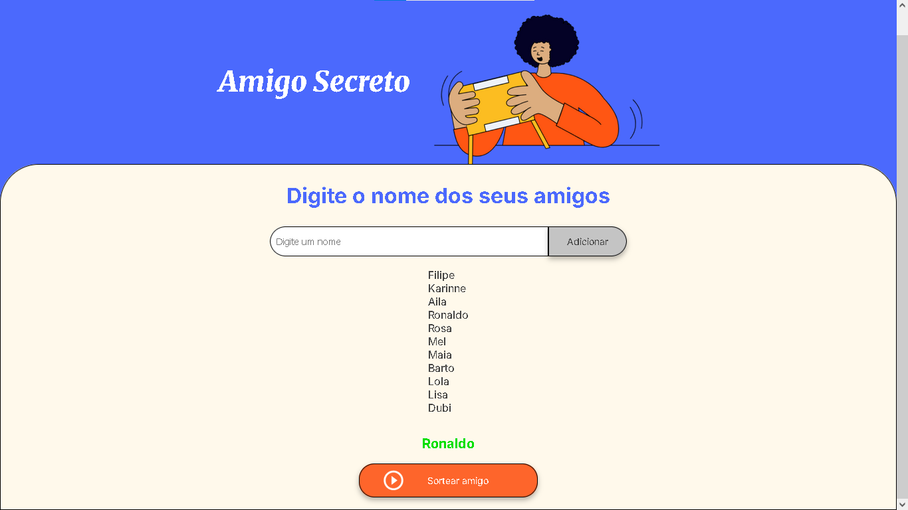

# 🎁 Amigo Secreto

Bem-vindo ao projeto **Amigo Secreto**! 🎉 Este é um aplicativo web interativo onde você pode adicionar amigos e sortear um nome aleatório para realizar um amigo secreto.

---

## 🚀 Funcionalidades

✅ Adicionar amigos à lista 📜  
✅ Ver a lista de amigos cadastrados 👥  
✅ Evitar nomes duplicados ❌  
✅ Sortear um amigo secreto aleatoriamente 🎲  
✅ Interface moderna e responsiva 📱💻  

---

## 📸 Demonstração

---

## 🛠️ Tecnologias Utilizadas

Este projeto foi desenvolvido utilizando as seguintes tecnologias:

- **HTML5** 📄
- **CSS3** 🎨
- **JavaScript (JS)** ⚡

---

## 📂 Estrutura do Projeto
📂 amigo-secreto │── 📜 index.html # Estrutura do site │── 📜 style.css # Estilos e layout │── 📜 app.js # Lógica do sorteio e interação │── 📂 assets # Imagens e ícones

